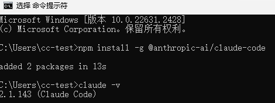
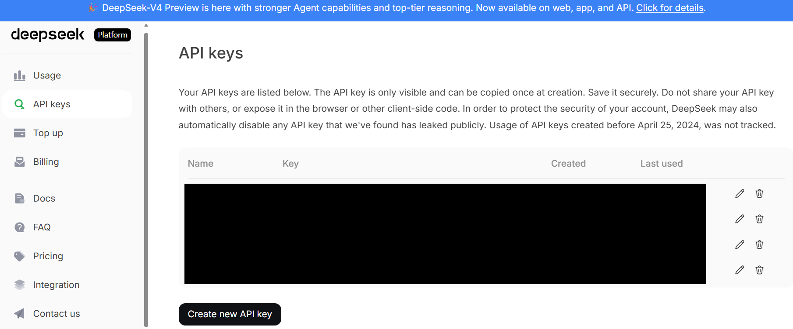
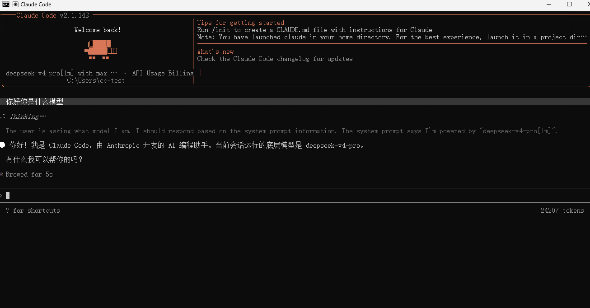

# Claude Code 指南

Claude Code 是 Anthropic 的命令行编码助手，可用于读写代码、执行命令和在终端里完成开发任务。这篇文档按依赖准备、Claude Code 安装、DeepSeek 接入、配置文件编写、启动使用和常见问题排查展开。

原版图文地址：<https://www.bilibili.com/opus/1203445769022996484>

> Claude Code 官方地址
> <https://code.claude.com/docs/zh-CN/overview>
> GitHub 地址
> <https://github.com/anthropics/claude-code>
> 官方安装方法（网络受限时不推荐，建议按正文中用 npm 安装）
> <https://code.claude.com/docs/zh-CN/setup>

## 安装 Git

见：[Windows/Mac/Linux/WSL 安装 Git](../../others/git.md)

## 安装 Node.js

见：[Windows/Mac/Linux/WSL 安装 Node.js](../../programme-env/nodejs.md)

## 安装 Claude Code

```bash
# 安装最新版本
npm install -g @anthropic-ai/claude-code

# 安装稳定通道版本
npm install -g @anthropic-ai/claude-code@stable

# 安装指定版本
npm install -g @anthropic-ai/claude-code@2.1.100
```

安装完成后验证：

```bash
claude --version
```

能看到版本号，就说明 CLI 已经装上了。



### 后续更新 Claude Code

如果后面需要手动更新 Claude Code，可以执行：

```bash
claude upgrade
```

本文后面的推荐配置里已经关闭了自动更新，因此后续如果想升级版本，记得手动执行这条命令。

## 申请 DeepSeek API，并把它接到 Claude Code

如果你准备直接用 Anthropic 官方账号，这一步可以略过。
国内更常见的方案：Claude Code 装在本地，后端走 DeepSeek 的 Anthropic 兼容接口。

### 先申请 DeepSeek API Key

DeepSeek 官方站点：<https://www.deepseek.com/>
API 文档：<https://api-docs.deepseek.com/zh-cn/>

1. 注册登录后，进入 API 平台，完成充值和密钥创建。
2. 目前最低充值 10 元，充值前需要实名认证。
3. 建议先小额尝试，确认自己确实会长期使用后，再按需要继续充值。
4. 创建 API Key 后，请立刻保存。平台通常不会再次完整展示同一把密钥。



DeepSeek 接入 Claude Code 的官方文档：
<https://api-docs.deepseek.com/zh-cn/quick_start/agent_integrations/claude_code>

## 配置 Claude Code

### 1. 创建或打开配置文件

```bash
# Windows 在 CMD 里执行
mkdir "%USERPROFILE%\.claude" 2>nul
if not exist "%USERPROFILE%\.claude\settings.json" (
    echo {} > "%USERPROFILE%\.claude\settings.json"
)
notepad "%USERPROFILE%\.claude\settings.json"

# Mac/Linux/WSL 在 Terminal 里执行
mkdir -p ~/.claude
if [ ! -f ~/.claude/settings.json ]; then
    echo "{}" > ~/.claude/settings.json
fi
nano ~/.claude/settings.json
# nano 保存退出方式：
# Ctrl + O
# Enter
# Ctrl + X
```

### 2. 写入示例配置

以接入 `DeepSeek` 为例，根据个人配置经验，可以参考下面这个 `settings.json` 作为推荐配置：

```json
{
  "$schema": "https://json.schemastore.org/claude-code-settings.json",
  "env": {
    "ANTHROPIC_BASE_URL": "https://api.deepseek.com/anthropic",
    "ANTHROPIC_AUTH_TOKEN": "sk-0000000000000000000000000000000",
    "API_TIMEOUT_MS": "3000000",
    "ANTHROPIC_MODEL": "deepseek-v4-pro[1m]",
    "ANTHROPIC_DEFAULT_OPUS_MODEL": "deepseek-v4-pro[1m]",
    "ANTHROPIC_DEFAULT_SONNET_MODEL": "deepseek-v4-pro[1m]",
    "ANTHROPIC_DEFAULT_HAIKU_MODEL": "deepseek-v4-flash",
    "CLAUDE_CODE_SUBAGENT_MODEL": "deepseek-v4-flash",
    "DISABLE_TELEMETRY": "1",
    "CLAUDE_CODE_DISABLE_NONESSENTIAL_TRAFFIC": "1",
    "CLAUDE_CODE_DISABLE_NONSTREAMING_FALLBACK": "1",
    "CLAUDE_CODE_ATTRIBUTION_HEADER": "0",
    "CLAUDE_CODE_EFFORT_LEVEL": "max",
    "ENABLE_TOOL_SEARCH": "false",
    "DISABLE_AUTOUPDATER": "1"
  },
  "permissions": {
    "defaultMode": "bypassPermissions",
    "ask": [
      "Bash(sudo *)",
      "Bash(rm *)",
      "Bash(rmdir *)",
      "Bash(unlink *)",
      "Bash(shred *)"
    ]
  },
  "availableModels": [
    "deepseek-v4-flash",
    "deepseek-v4-pro",
    "deepseek-v4-flash[1m]",
    "deepseek-v4-pro[1m]"
  ],
  "attribution": {
    "commit": "",
    "pr": ""
  },
  "language": "中文",
  "effortLevel": "high",
  "theme": "auto",
  "editorMode": "normal",
  "verbose": true,
  "tui": "fullscreen"
}
```

注意把 `ANTHROPIC_AUTH_TOKEN` 替换为你自己的 key。

参考
- [Deepseek 接入 Coding Agents](https://api-docs.deepseek.com/zh-cn/guides/coding_agents)
- [Claude Code 环境变量官方文档](https://code.claude.com/docs/zh-CN/env-vars)，使用参数说明见附录。

## 启动 Claude Code

进入你的项目目录，在资源管理器的地址栏输入 `cmd`，在打开的 CMD 窗口中执行：

```cmd
claude
```

如果一切正常，Claude Code 会启动交互界面。

如果第一次进入，可能需要先选择主题，直接选自己喜欢的主题即可。

你可以先问一个很简单的问题，比如：

`你好，你是什么模型？`

如果配置正确，它通常会根据当前接入的后端模型来回答。

另外可以直接让它做一个最小任务。例如在项目目录里让它：

- 列出当前仓库顶层文件
- 解释 `README.md` 的主要内容
- 说明它当前准备使用的模型和工具环境

这样你更容易判断，到底是 CLI 没装好、Shell 不可用、仓库没识别，还是 API 配置本身出了问题。

你可以把“成功”理解成下面三个信号同时出现：

- `claude` 可以正常进入交互界面，没有启动时报错
- 它能读取当前项目目录并回答和仓库内容相关的问题
- 调用过程中没有出现明显的 `401`、`403`、余额不足、超时或模型不存在之类的错误



## 快捷启动方式

- windows 用户将 [cc.bat](./cc.bat) 下载到桌面，双击即可启动 Claude Code
- macOS 用户将 [ccmac.sh](./ccmac.sh) 文件下载到 `~/.claude` 下
- Linux/WSL 用户将 [cclinux.sh](./cclinux.sh) 文件下载到 `~/.claude` 下

```bash
# Mac
# 写入 zsh 启动配置
grep -qxF 'source ~/.claude/ccmac.sh' ~/.zshrc || echo 'source ~/.claude/ccmac.sh' >> ~/.zshrc
# 立即生效
source ~/.zshrc

# Linux/WSL
# 写入 bash 启动配置
grep -qxF 'source ~/.claude/cclinux.sh' ~/.bashrc || echo 'source ~/.claude/cclinux.sh' >> ~/.bashrc
# 立即生效
source ~/.bashrc

# 后续直接在终端中使用 cc 启动
cc
```

- 使用前建议根据实际情况修改 `base` 项目根目录，例如设置为 `D:\workspace`，用于存放和管理所有项目；
- 脚本会自动列出项目根目录下的一级项目文件夹，也支持创建新项目并自动进入对应目录；
- 启动时会自动扫描 `%USERPROFILE%\.claude` 下的 `settings*.json` 配置文件，可按需选择不同的 Claude 配置；
- 脚本默认带有 `--dangerously-skip-permissions` 参数，用于跳过部分权限确认提示；该参数风险较高，建议仅在可信项目目录中使用，如不需要可从脚本最后的 `claude ...` 启动命令中删除；
- 请确保 BAT 文件保存为 **UTF-8（无 BOM）** 编码和 **CRLF** 换行格式，避免中文乱码或命令解析异常；
- 如需调整目录结构、启动参数、权限确认方式或其他行为，可直接让 Agent 根据需求修改脚本。

## 全局指令

CLAUDE.md 是 Claude Code 读取的项目/用户级指令文件，作用是告诉编码智能体“项目怎么构建、测试、改代码、遵守哪些规范”；通常放在项目根目录，必要时也可放在子目录做局部规则，用户全局规则则分别放在对应工具支持的用户配置目录中。

本人使用指令文件参考：

[CLAUDE.md](./CLAUDE.md)

可以下载后放到 `%USERPROFILE%/.claude` 下或者项目根目录的 `.claude` 文件夹下。

## 常见问题

### 1. `claude` 命令找不到

通常从这几个方向查：

- Node.js 是否真的安装成功
- npm 全局安装目录是否在 PATH 中
- 你是不是装完后没有重开终端
- Git 和 Node.js 是否装在了非默认目录

如果你是用 npm 安装的，也可以执行：

```bash
npm list -g @anthropic-ai/claude-code
```

先确认包到底有没有装上。

### 2. npm 下载太慢或超时

先看 registry：

```bash
npm config get registry
```

如果不是 `https://registry.npmmirror.com`，就重新切一下。

### 3. Claude Code 能启动，但模型调用失败

优先检查这几项：

- `ANTHROPIC_BASE_URL` 是否写成了 `https://api.deepseek.com/anthropic`
- `ANTHROPIC_AUTH_TOKEN` 是否是真实有效的 DeepSeek key
- 模型名是否和当前 DeepSeek 文档一致
- 账户余额、额度、风控或限流是否正常

## 附录

## 配置参考资料

- 更新日志位于：`.claude/cache/changelog.md`
- <https://code.claude.com/docs/zh-CN/settings#claude-code-%E8%AE%BE%E7%BD%AE>
- <https://code.claude.com/docs/zh-CN/env-vars>
- <https://code.claude.com/docs/zh-CN/model-config>
- <https://code.claude.com/docs/zh-CN/remote-control>
- <https://code.claude.com/docs/zh-CN/costs>
- <https://code.claude.com/docs/zh-CN/mcp>
- <https://code.claude.com/docs/zh-CN/discover-plugins>

### 部分配置参数说明

- `"CLAUDE_CODE_DISABLE_NONESSENTIAL_TRAFFIC": "1"`
  - 用于进一步减少与 Anthropic 服务器之间的非核心网络交互。
  - 该变量的主要目的是在不影响核心 AI 功能（如对话和代码生成）的前提下，尽可能实现“网络精简”。启用后，它会产生以下具体效果：
    - 禁用部分监控工具：它会关闭某些在 DISABLE_TELEMETRY 基础上仍然运行的辅助流量。
    - 限制实验性功能：许多通过远程开关（Experiment Gates）控制的新特性或 A/B 测试会被禁用，系统将直接回退到本地默认值。
    - 禁用 Remote Control（远程控制）：设置此变量会导致 Remote Control 功能因无法进行权限和组织校验而无法启用。
    - 减少背景心跳：减少客户端与云端之间用于检查更新或同步状态的非必要请求。
  - 使用场景
    - 高安全性环境：在需要严格审计所有外发流量的企业内网中，开启此选项可以减少不必要的连接。
    - 网络不稳定/受限：在弱网环境或计费流量下，减少背景请求可以提高 CLI 的稳定性。
    - 追求极致纯净：如果不希望参与任何未记录的功能实验，设置此项可确保始终运行基础稳定版逻辑。

- `CLAUDE_CODE_DISABLE_NONSTREAMING_FALLBACK: "1"`
  - 默认行为：如果流式连接由于超时或网络抖动而中断，Claude Code 通常会尝试通过传统的非流式 API 调用来获取响应，以确保对话不中断。
  - "禁用非流式回退" —— 开启表示如果流式传输失败，系统将直接报错而不是转入非流式模式，调试流式传输中断的具体原因时推荐开启。
  - 可选不开启，

- `DISABLE_TELEMETRY: "1"`
  - 仅关闭遥测数据上传（使用统计/行为数据）。
  - 过去设置 DISABLE_TELEMETRY=1 会错误地把 prompt 缓存TTL降到 5 分钟并关闭 recap，导致性能下降和 token 成本增加；现在 `version 2.1.108` 已修复为仅关闭数据上传，不再影响缓存（恢复≈1小时）和 recap，从而恢复性能与连续体验。

- `CLAUDE_CODE_ENABLE_AWAY_SUMMARY: "1"`
  - 启用离开/空闲后的会话总结（session recap）
  - 默认已开启，即使关闭 telemetry 也会生效。
  - 在你离开或上下文变长时，自动生成一段精简总结，用来替代历史对话，`version 2.1.110` 引入。
  - 避免模型“忘记之前做了什么”，用短摘要替代长历史，减少输入长度，提高响应速度，支持长时间、多阶段任务。
  - 触发时机
    - 会话太长（context 接近上限）
    - 用户一段时间未操作（away）
    - 多轮复杂任务。

- `CLAUDE_CODE_EFFORT_LEVEL: "max"`
  - 选择工作量级别，每个级别都在令牌支出和功能之间进行权衡。
  - 推荐通过以下任何方式更改工作量：
    - 可运行 /effort 打开交互式滑块，运行 /effort 后跟级别名称直接设置，或运行 /effort auto 重置为模型默认值
    - 在 skill 或 subagent markdown 文件中设置 effort 以在该 skill 或 subagent 运行时覆盖工作量级别
  - 默认值适合大多数编码任务；可全局或者进行调整：
    - low: 保留用于短期、范围有限、延迟敏感且不需要高智能的任务
    - medium: 减少成本敏感工作的令牌使用，可以权衡一些智能
    - high: 平衡令牌使用和智能。用作智能敏感工作的最低要求，或相对于 xhigh 减少令牌支出
    - xhigh: 大多数编码和代理任务的最佳结果。Opus 4.7 上的推荐默认值
    - max: 可以改进困难任务的性能，但可能显示收益递减，容易过度思考。在广泛采用前进行测试
    - auto: 自动选择级别，根据任务和模型选择最佳级别

- `ENABLE_TOOL_SEARCH: "false"`
  - 控制 MCP 工具搜索。未设置：默认延迟所有 MCP 工具，但当 ANTHROPIC_BASE_URL 指向非第一方主机时提前加载。
  - 可选值（如果代理转发 tool_reference 块，请设置 true）：
    - true（始终延迟，包括代理）
    - auto（阈值模式：如果工具适合在上下文的 10% 内则提前加载）
    - auto:N（自定义阈值，例如 auto:5 表示 5%）
    - false（提前加载所有）

### 本地文件索引

#### 零、最小关注集合（优先理解）

| 类别 | 路径 |
| ---------- | -------------------------------------- |
| 身份/会话 | `~/.claude.json` |
| 用户级策略 | `~/.claude/settings.json`、`~/.claude/` |
| 项目级策略 | `./.claude/settings.json`、`./.claude/` |
| 外部能力（工具接入） | `./.mcp.json` |

---

#### 一、全局（用户级）路径与配置

| 路径 | 类型 | 内容/职责（压缩表达） |
| ------------------------- | --- | -------------------------------------------------------- |
| `~/.local/bin/claude` | 可执行 | **主体 CLI 入口（native binary）**：负责启动、命令分发、加载全局与项目配置并执行 |
| `~/.local/share/claude/` | 目录 | **运行时/版本数据目录**：存储安装版本、自动更新缓存、运行辅助数据 |
| `~/.claude/` | 目录 | **用户级主配置根目录**：MCP servers、全局 hooks、工具权限、agent 模板、跨工具共享配置 |
| `~/.claude/settings.json` | 文件 | **用户级默认参数配置**：定义默认模型、temperature、工具策略、日志等级、超时等（被项目级覆盖） |
| `~/.claude.json` | 文件 | **用户身份与会话状态文件**：保存登录 token、最近使用配置、CLI 状态缓存 |
| `~/.config/claude/` | 目录 | **扩展/GUI 配置桥接目录**：部分 IDE（VSCode/JetBrains）或系统环境使用 |
| `~/.cache/claude/` | 目录 | **临时缓存目录**：下载缓存、运行中间数据，用于性能优化 |

---

#### 二、项目级（workspace）路径与配置

| 路径 | 类型 | 内容/职责（压缩表达） |
| ------------------------- | -- | ------------------------------------------------------- |
| `./.claude/` | 目录 | **项目级主配置根目录**：定义当前项目的行为（agents / hooks / tools），优先级高于全局 |
| `./.claude/settings.json` | 文件 | **项目级参数覆盖配置**：覆盖用户级 settings，精确控制模型、工具、预算、执行策略 |
| `./.claude/agents/` | 目录 | **多 Agent 编排目录**：定义主/子 agent 的职责、提示词与调度关系 |
| `./.claude/hooks/` | 目录 | **自动化钩子目录**：任务执行前后触发脚本（如构建、测试、数据处理） |
| `./.claude/tools/` | 目录 | **自定义工具封装目录**：对本地脚本/CLI/API 的抽象封装供 agent 调用 |
| `./.mcp.json` | 文件 | **MCP 协议核心配置**：定义外部能力（数据库/API/本地服务）及通信方式 |
| `./.claudeignore` | 文件 | **上下文过滤规则文件**：控制哪些文件进入模型上下文（优化 token 使用） |
| `./.env` | 文件 | **运行时环境变量文件**：存储 API key、运行参数（供工具/MCP 使用） |

#### 三、关键机制总结

| 机制 | 说明 |
| ------- | -------------------------------------------- |
| 配置优先级 | 项目级 `./.claude` > 用户级 `~/.claude` |
| 行为来源 | settings.json（参数） + agents/hooks/tools（执行逻辑） |
| 工具接入 | `.mcp.json` 定义外部能力 |
| 状态与配置分离 | `.claude.json`（状态） ≠ `settings.json`（策略） |