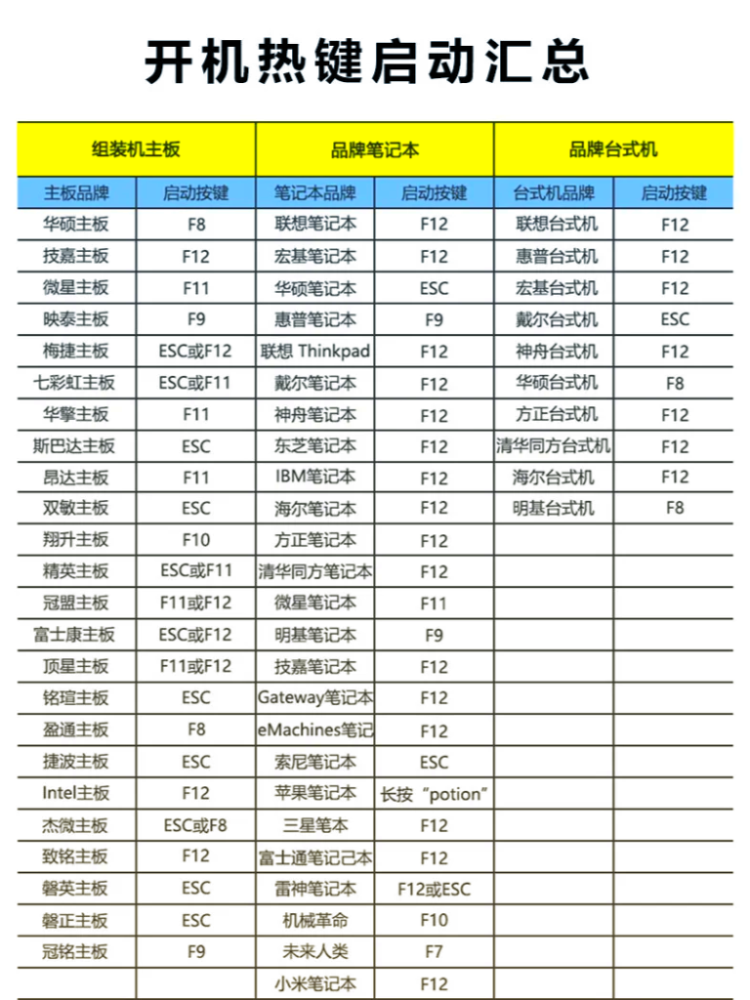

# Windows 10/11 + Ubuntu 26.04 LTS 双系统安装指南

本文适用于在已有 Windows 10/11 的 x86-64 电脑上安装 Ubuntu 26.04 LTS，目标是：

```text
Windows 保留
+ Ubuntu 独立分区
+ UEFI/GRUB 双系统启动
+ NVIDIA 驱动正常
```

对于标准 Ubuntu 内核，NVIDIA 驱动优先使用 **Canonical 预编译并签名的内核模块**；只有自定义内核或官方没有对应预编译模块时才考虑 DKMS。Ubuntu 官方也明确推荐普通用户优先使用 `ubuntu-drivers`，默认选择预编译、已签名且兼容 Secure Boot 的驱动。([Ubuntu][1])

---

## 1. 安装前检查

管理员 PowerShell：

```powershell
# 查看 Windows 架构
Get-CimInstance Win32_OperatingSystem |
    Select Caption, OSArchitecture

# 查看磁盘是否为 GPT
Get-Disk |
    Select Number, FriendlyName, PartitionStyle, Size

# 查看 BitLocker
manage-bde -status

# 查看休眠状态
powercfg /a
```

按 `Win + R`：

```text
msinfo32
```

确认：

```text
系统类型：x64-based PC
BIOS 模式：UEFI
```

建议条件：

| 项目 | 推荐 |
| ------------- | -------------------- |
| CPU | Intel / AMD x86-64 |
| 启动模式 | UEFI |
| 系统盘 | GPT |
| Ubuntu 空间 | ≥80GB，开发建议 150–300GB |
| U盘 | ≥8GB，推荐 16GB |
| BitLocker恢复密钥 | 已备份 |

安装前请确认恢复密钥已保存到 Microsoft 帐户或离线安全位置。后续若需要对 Windows 分区完整解密，恢复密钥丢失会增加数据恢复风险。

如果 Windows 是：

```text
Legacy + MBR
```

不要直接切换 BIOS 到 UEFI，应先单独完成 MBR→GPT 转换并确认 Windows 可以 UEFI 启动。

---

## 2. 备份

至少备份：

```text
重要文件
SSH Key
代码
BitLocker 48位恢复密钥
磁盘管理界面截图
```

双系统安装涉及 EFI、分区表和启动链，BitLocker 恢复密钥尤其重要。

---

## 3. 下载 Ubuntu 26.04

优先从 [Ubuntu 官方下载页](https://ubuntu.com/download/desktop) 获取镜像。下载较慢时，可使用 [华为云 Ubuntu Releases 镜像目录](https://repo.huaweicloud.com/ubuntu-releases/)；无论使用哪一来源，都必须从同一发布目录取得对应的 `SHA256SUMS`。

Ubuntu桌面版的安装镜像文件名为：ubuntu-<版本号>-desktop-amd64.iso

普通 Intel/AMD 电脑下载：

```text
ubuntu-26.04-desktop-amd64.iso
```

`amd64` 同时适用于 Intel 和 AMD 64 位 CPU。

下载后校验 SHA-256：

```powershell
# 将路径替换为实际下载位置
Get-FileHash `
  "$env:USERPROFILE\Downloads\ubuntu-26.04-desktop-amd64.iso" `
  -Algorithm SHA256
```

与 `SHA256SUMS` 完全一致后再制作 U 盘。

---

## 4. Rufus 制作安装盘

推荐参数：

```text
设备：安装 U 盘
引导选择：Ubuntu ISO
分区类型：GPT
目标系统：UEFI（非 CSM）
文件系统：保持 Rufus 自动选择
写入方式：ISO Image mode
```

注意：

```text
不要强制指定 FAT32
不要选择 Legacy/CSM
制作过程会清空 U 盘
```

---

## 5. Windows 中准备 Ubuntu 空间

### 5.1 BitLocker

先备份恢复密钥，再检查：

```cmd
manage-bde -status
```

如果 Ubuntu 要使用的 Windows 磁盘/分区启用了 BitLocker，建议先完整解密：

```cmd
manage-bde -off C:
```

等待：

```text
Percentage Encrypted: 0.0%
Fully Decrypted
```

不要使用来源不明的第三方“BitLocker关闭工具”。

### 5.2 关闭休眠/快速启动

管理员 CMD：

```cmd
powercfg /hibernate off
```

然后真正关机一次：

```cmd
shutdown /s /t 0
```

避免 Windows NTFS 保持休眠状态。

### 5.3 压缩分区

运行：

```text
diskmgmt.msc
```

选择空间充足的 NTFS 分区：

```text
右键
→ 压缩卷
→ 输入 Ubuntu 空间
```

例如：

```text
200GB = 204800MB
```

得到：

```text
200GB 未分配空间
```

这里：

```text
不要格式化
不要新建 NTFS 卷
不要分配盘符
```

---

## 6. 双硬盘时的推荐结构

例如：

```text
Disk 0：Windows SSD
├── EFI
├── Windows
└── Recovery

Disk 1：数据/Ubuntu SSD
├── 原数据分区
└── 200GB 未分配
```

有两种方案。

### 方案 A：共用 Windows EFI

```text
Disk 0 EFI  → /boot/efi
Disk 1 ext4 → /
```

完全可用。

### 方案 B：Ubuntu 独立 EFI【双硬盘更推荐】

```text
Disk 0
├── Windows EFI
└── Windows

Disk 1
├── 1GiB FAT32 ESP → /boot/efi
└── 约199GiB ext4 → /
```

优点：

```text
Windows 与 Ubuntu 启动链独立
任意一块硬盘拆除时另一系统仍更容易独立启动
重装 Windows 不容易影响 Ubuntu 引导
```

---

## 7. 从 U 盘启动

重启后进入 Boot Menu，常见：

```text
F12
F2
Esc
F10
```

具体可参见



必须选择：

```text
UEFI: <U盘名称>
```

而不是 Legacy USB。

先进入：

```text
Try Ubuntu
```

检查：

```text
屏幕
键盘
Wi-Fi
触控板
声音
SSD/NVMe
```

如果 NVIDIA 电脑 Live 环境黑屏，可尝试：

```text
Ubuntu (safe graphics)
```

---

## 8. 如果 Ubuntu 看不到 SSD

如果出现：

```text
Intel RST
VMD
RAID
SSD 不可见
```

不要继续安装。

不要直接：

```text
RAID → AHCI
```

否则 Windows 可能出现：

```text
INACCESSIBLE_BOOT_DEVICE
```

应先让 Windows 准备 AHCI 驱动，再在 BIOS 中关闭 RST/VMD。

这一问题与普通分区问题不同，应单独解决后再安装 Ubuntu。

---

## 9. 安装 Ubuntu

推荐：

```text
Install Ubuntu
→ Interactive installation
→ Default selection
```

网络稳定时可以联网安装。

安装类型优先：

```text
Install Ubuntu alongside Windows Boot Manager
```

绝对不要误选：

```text
Erase disk and install Ubuntu
```

---

## 10. 手动分区

如果使用手动分区，可以选择两种方案，对于多硬盘且分区在非系统盘时，共用 EFI 便于后期扩容，独立 EFI 更利于双系统独立启动，硬盘单独拆除时另一系统仍更容易独立启动。

### 共用 EFI

现有 Windows EFI：

```text
FAT32
挂载：/boot/efi
格式化：否
```

Ubuntu 空间：

```text
ext4
挂载：/
格式化：是
```

### 独立 EFI

Ubuntu 所在第二块硬盘：

```text
1 GiB
FAT32
EFI System Partition
挂载：/boot/efi
```

剩余：

```text
ext4
挂载：/
```

普通桌面系统没有必要专门建立 swap 分区，可以使用 swapfile。

### 安装前必须再次检查

不能格式化：

```text
Windows NTFS
Windows EFI
Microsoft Reserved
Recovery
OEM
```

---

## 11. 安装后检查

重启后 GRUB 应能看到：

```text
Ubuntu
Windows Boot Manager
```

先分别启动一次 Ubuntu 和 Windows。

Ubuntu 中：

```bash
# 更新系统
sudo apt update
sudo apt upgrade -y
sudo reboot
```

检查 UEFI：

```bash
test -d /sys/firmware/efi && echo UEFI
```

检查分区：

```bash
lsblk -f
findmnt /
findmnt /boot/efi
```

---

## 12. NVIDIA 驱动：Canonical 预编译模块【推荐】

如果没有 NVIDIA 电脑，可以跳过此步骤。

这是 Ubuntu 26.04 标准内核的首选方案。

其结构是：

```text
NVIDIA 提供驱动代码
        ↓
Canonical 针对 Ubuntu 内核预编译
        ↓
Canonical 签名
        ↓
Ubuntu 官方仓库
        ↓
Secure Boot 可直接验证
```

优点：

```text
不需要本机编译
内核升级失败概率低
不需要自行管理 MOK
与 Secure Boot 配合最好
适合普通 Desktop / CUDA / AI / Docker
```

Ubuntu 官方建议普通用户使用 `ubuntu-drivers` 或“附加驱动”管理驱动；默认只会安装已知可与 Secure Boot 配合的预编译、已签名模块。([Ubuntu][1])

### 安装

先更新：

```bash
sudo apt update
sudo apt upgrade
sudo reboot
```

查看可用驱动：

```bash
sudo ubuntu-drivers list
```

自动安装推荐驱动：

```bash
sudo ubuntu-drivers install
sudo reboot
```

不要添加 `--include-dkms`；它会改为选择 DKMS 方案，相关限制见文末附录。

### 验证

```bash
# NVIDIA 驱动
nvidia-smi

# 当前模块文件
modinfo -n nvidia

# 模块签名者
modinfo -F signer nvidia
```

理想状态类似：

```text
/lib/modules/<kernel>/kernel/nvidia-<版本>/nvidia.ko

Canonical Ltd. Kernel Module Signing
```

模块路径不应位于：

```text
/updates/dkms/nvidia.ko
```

再检查：

```bash
mokutil --sb-state
```

若同时确认：

```text
Canonical signed module
+
nvidia-smi 正常
```

即可在 BIOS 中保持或重新开启：

```text
Secure Boot = Enabled
```

重新进入 Ubuntu 后再次验证：

```bash
mokutil --sb-state
nvidia-smi
```

---

## 附录：仅在需要时使用 DKMS

DKMS 会在本机为正在运行的内核编译 NVIDIA 模块。只有使用自定义内核、特殊内核 flavour，或官方仓库暂时没有当前内核的预编译模块时才选择它。普通 Ubuntu Desktop、CUDA、PyTorch、Docker 和科学计算场景均应继续使用正文方案；不要安装 NVIDIA 官网 `.run` 包。([Ubuntu][2])

在 Secure Boot 启用时，DKMS 模块不由 Canonical 密钥签名，需要创建并在启动时注册自己的 MOK；未完成注册时模块无法加载。安装过程若要求设置 MOK 密码，重启后在 MokManager 依次选择 `Enroll MOK`、`Continue`、`Yes`，输入该密码后再重启。若启动至 MokManager 时键盘无响应，这是内核启动前的固件界面问题，蓝牙键盘、SSH 与桌面键盘设置都无效。标准内核已有预编译模块时，应改回正文方案，而不是反复尝试 MOK。

需要 DKMS 时，先安装与当前内核匹配的 headers，再由 `ubuntu-drivers` 选择驱动：

```bash
sudo apt install linux-headers-$(uname -r)
sudo ubuntu-drivers install --include-dkms
```

若需要固定驱动分支，也可以手动安装：

```bash
sudo apt install nvidia-dkms-<版本>
```

用以下命令确认当前实际加载的模块：

```bash
modinfo -n nvidia
modinfo -F signer nvidia
```

`/updates/dkms/nvidia.ko*` 或本机 MOK 签名表示正在使用 DKMS；`/kernel/nvidia-<版本>/nvidia.ko` 与 `Canonical Ltd. Kernel Module Signing` 表示正在使用预编译模块。系统同时安装相关包不代表两个模块同时工作，以上两个命令才是判断依据。

若要从 DKMS 切回预编译模块，先暂时关闭 Secure Boot，确保移除过程中系统可正常启动；再确认 `dpkg -l | grep linux-modules-nvidia` 能找到对应包，随后先模拟、后删除 DKMS 包。重启后按正文“验证”复查并重新开启 Secure Boot。不同驱动分支的包名不同，切勿使用通配删除命令。

```bash
sudo apt -s purge nvidia-dkms-<版本>
sudo apt purge nvidia-dkms-<版本>
sudo depmod -a
sudo update-initramfs -u
sudo reboot
```

两种方案的 CUDA/AI 性能通常无本质差异；主要区别是模块由谁编译和签名，以及内核升级时的维护成本。Canonical 预编译模块由 Canonical 构建与签名，可直接配合 Secure Boot；DKMS 由本机构建，需自行处理 MOK。

---

[1]: https://ubuntu.com/desktop/docs/en/latest/how-to/graphics/install-nvidia-drivers/ "Install NVIDIA drivers - Ubuntu Desktop documentation"
[2]: https://ubuntu.com/desktop/docs/en/26.04/how-to/graphics/nvidia-driver-packages/ "Select NVIDIA driver packages manually - Ubuntu Desktop documentation"
